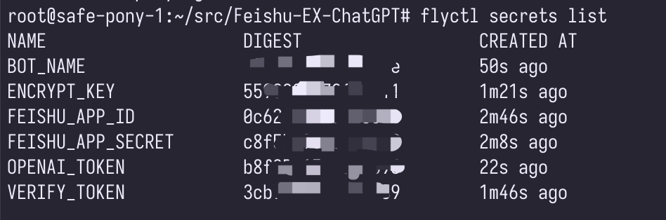
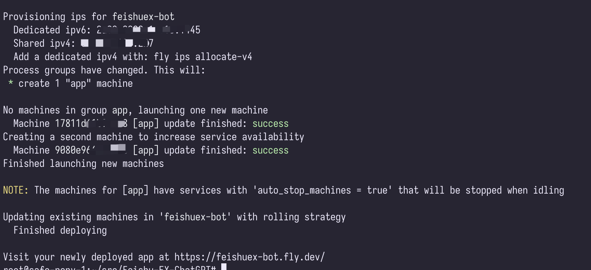
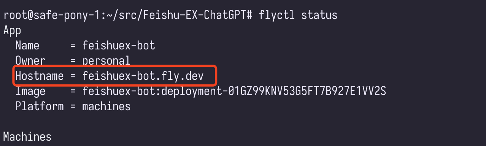
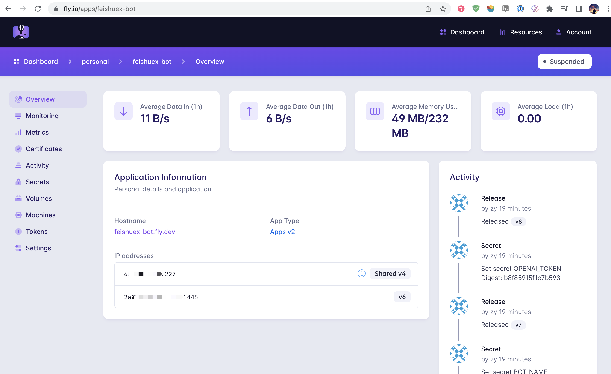

# Feishu-EX-ChatGPT


Feishu-EX-ChatGPT 是让飞书接入一个拥有增强版本的 ChatGPT 功能。
通过集成各种插件，Feishu-EX-ChatGPT 可以让 ChatGPT 更好地与外部服务进行交互。插件可以轻松扩展，并通过注册机制来注册和激活。此外，Feishu-EX-ChatGPT 插件系统还支持第三方服务的扩展能力。⚡

## 功能 ✨

1. 通过集成不同的插件来增强 ChatGPT 的外部能力。
2. 插件可以进行随意扩展，并通过注册机制完成插件的注册与激活。
3. 利用插件机制，实现对第三方服务的扩展能力。

一起贡献更多插件能力，增强 FeishuEx 扩展能力。[github.com/agi-cn/llmplugin](https://github.com/agi-cn/llmplugin)


1. 正常提问，使用 ChatGPT 回答。
2. 以 `#` 开头提问，使用插件进行回答。


## 工作流程 🌊


1. 注册插件列表以获取扩展能力。📝
2. 根据用户的提问，选择并激活相应的插件（可能是一个或多个）。🎯
3. 等待获取所有插件的结果，并汇总所有结果。🔁
4. 将汇总后的结果返回给用户。🔙


## 如何开始 🛠️

1. 克隆此仓库到本地。
2. 在项目中，根据需要创建自己的插件并实现相应的接口。
3. 注册并激活插件。
4. 开始使用 Feishu-EX-ChatGPT 与 ChatGPT 进行交互！🎉


现在开始使用 Feishu-EX-ChatGPT，让您的飞书接入的 ChatGPT 拥有的功能更强大吧！🚀


## 运行

支持本地运行，或者使用 fly.io 进行部署。

运行时，依赖环境变量支持，环境变量加载形式有：

1. 设置系统环境变量
2. 加载 .env 环境变量定义文件

具体环境变量参考：`./dotenv.example` 文件说明。


### 1. 本地运行

使用 .env 环境变量文件，

```bash
cp dotenv.example .env

go run ./cmd
```

### 2. 集成 Stable Diffusion 插件


### 2. 搜索插件支持

支持搜索引擎如下，

1. agi.cn search 搜索插件 - 封装了 duckduckgo 搜索能力，且不需要额外申请 token，默认集成。
2. 支持 Google Search 插件能力（需要申请 Google Search Engine Token）。

<details>
    <summary>申请 Google 搜索接口</summary>

1. 获取 [GOOGLE_ENGINE_ID](http://www.google.com/cse/)
2. 开通 [GOOGLE_SEARCH_API](https://console.cloud.google.com/apis/api/customsearch.googleapis.com/metrics)
2. 获取 [GOOGLE_TOKEN](https://console.cloud.google.com/apis/credentials?pli=1&project=bobmac-344202)

[主要参考](https://stackoverflow.com/questions/37083058/programmatically-searching-google-in-python-using-custom-search)

</details>

没有配置 Google Search 的环境变量，则默认启动 duckduckgo 搜索。


### 2. 飞书提问

1. 没有支持 Plugin 时，效果如下，

  

2. 支持 Plugin 时，效果，

  


## 如何贡献

1. 代码结构参考「整洁架构思想」，具体说明参考 [github.com/xpzouying/go-clean-arch](https://github.com/xpzouying/go-clean-arch)。
2. 编码规范参考 [Go Code Review](https://github.com/golang/go/wiki/CodeReviewComments)


## 部署机器人

### 1. 部署飞书机器人服务

因为飞书需要访问公网的 IP 地址，所以我们使用 [fly.io](https://fly.io/) 进行部署。一般情况下，免费额度都够用。

<details>
    <summary>fly.io 部署流程</summary>

以 MacOS 为例，其他的类似。

1. 登录 [https://fly.io/dashboard](https://fly.io/dashboard) 并注册账号。

2. 安装 [Fly CLI](https://fly.io/docs/getting-started/installing-flyctl/)。

3. 运行命令登录，`flyctl auth login`。

  ```bash
  Waiting for session... Done
  successfully logged in as xpzouying@gmail.com
  ```

4. 运行 `flyctl apps create`，输入 app name： `feishuex-bot`。

5. 使用 flyctl env 配置各种环境变量。
  * flyctl secrets set FEISHU_APP_ID=cli_xxx
  * flyctl secrets set FEISHU_APP_SECRET=abcABCxxx
  * flyctl secrets set VERIFY_TOKEN=abcABCxxx
  * flyctl secrets set ENCRYPT_KEY=abcABCxxx
  * flyctl secrets set BOT_NAME=feishu-bot
  * flyctl secrets set OPENAI_TOKEN=sk-xxx

  配置后，使用 `flyctl secrets list` 查看环境变量设置。
  

6. 部署程序：`flyctl deploy`。
  


7. 查看状态：

  * 通过命令行查看：`flyctl status`
    

  * 通过页面查看 [https://fly.io/dashboard/personal](https://fly.io/dashboard/personal)
    

</details>


### 2. 配置飞书机器人

使用 fly.io 成功部署后，可以在飞书开发平台配置请求地址。


## 联系

欢迎讨论更多功能扩展，

 


## 赞助感谢

友情感谢 'Find My Ai' 提供的部分经费赞助！


