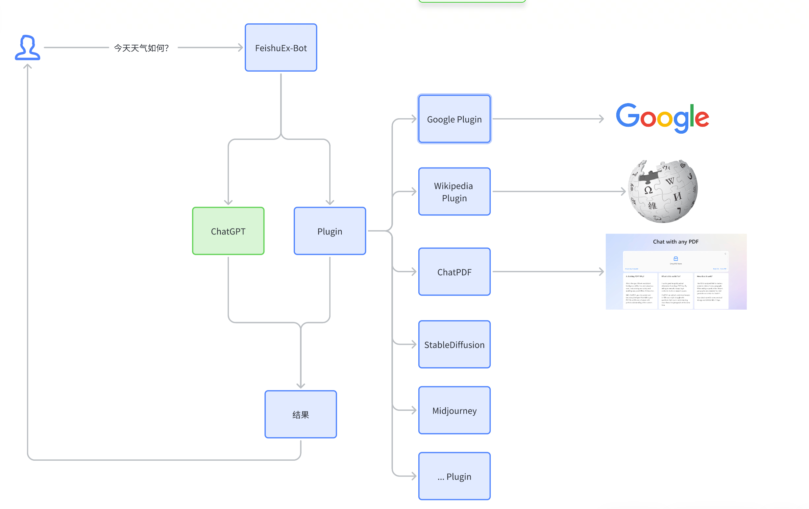

# Feishu-EX-ChatGPT


Feishu-EX-ChatGPT 是让飞书接入一个拥有增强版本的 ChatGPT 功能。
通过集成各种插件，Feishu-EX-ChatGPT 可以让 ChatGPT 更好地与外部服务进行交互。插件可以轻松扩展，并通过注册机制来注册和激活。此外，Feishu-EX-ChatGPT 插件系统还支持第三方服务的扩展能力。⚡

## 功能 ✨

1. 通过集成不同的插件来增强 ChatGPT 的外部能力。
2. 插件可以进行随意扩展，并通过注册机制完成插件的注册与激活。
3. 利用插件机制，实现对第三方服务的扩展能力。

## 工作流程 🌊



1. 注册插件列表以获取扩展能力。📝
2. 根据用户的提问，选择并激活相应的插件（可能是一个或多个）。🎯
3. 等待获取所有插件的结果，并汇总所有结果。🔁
4. 将汇总后的结果返回给用户。🔙


## 如何开始 🛠️

1. 克隆此仓库到本地。
2. 在项目中，根据需要创建自己的插件并实现相应的接口。
3. 注册并激活插件。
4. 开始使用 Feishu-EX-ChatGPT 与 ChatGPT 进行交互！🎉


现在开始使用 Feishu-EX-ChatGPT，让您的飞书接入的 ChatGPT 拥有的功能更强大吧！🚀


## 运行

以 Google Search 插件为例，

提示：运行前需要配置对应的环境变量，支持两种方式：

1. 设置系统环境变量
2. 加载 .env 环境变量定义文件

<details>
    <summary>申请 Google 搜索接口</summary>

1. 获取 [GOOGLE_ENGINE_ID](http://www.google.com/cse/)
2. 获取 [GOOGLE_TOKEN](https://console.cloud.google.com/apis/credentials?pli=1&project=bobmac-344202)

[主要参考](https://stackoverflw.com/questions/37083058/programmatically-searching-google-in-python-using-custom-search)

</details>


### 1. 本地运行

使用 .env 环境变量文件，

```bash
cp dotenv.example .env

go run ./cmd
```

### 2. 飞书提问

1. 没有支持 Plugin 时，效果如下，

  

2. 支持 Plugin 时，效果，

  


## 如何贡献

1. 代码结构参考「整洁架构思想」，具体说明参考 [github.com/xpzouying/go-clean-arch](https://github.com/xpzouying/go-clean-arch)。
2. 编码规范参考 [Go Code Review](https://github.com/golang/go/wiki/CodeReviewComments)


## 联系

欢迎飞书讨论更多功能扩展，


